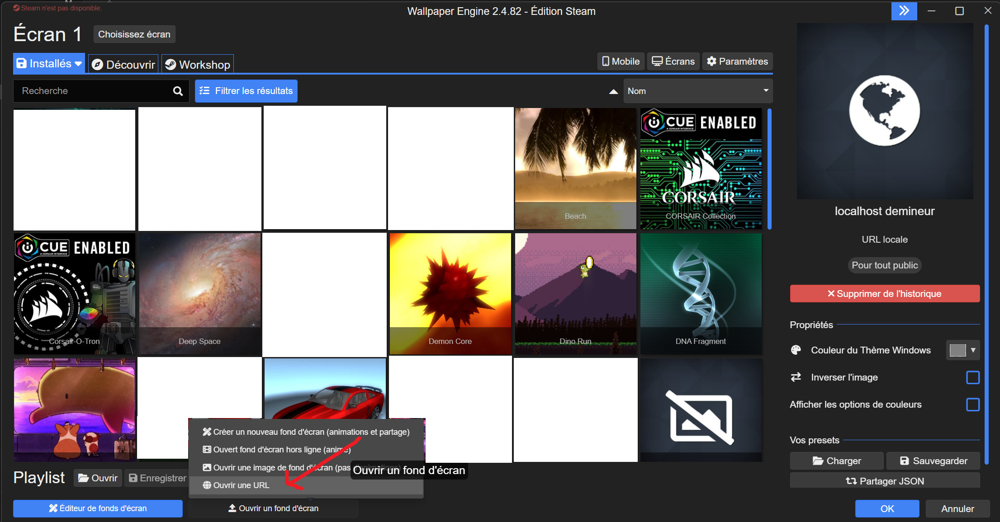

# Demineur

Installation dans Wallpaper Engine :

url : `http://89.168.59.122:54123/index.html`

Créer un nouveau wallpaper à partir d'un URL

Rentrer l'URL au dessus et bind un raccourci afin de pouvoir cacher les icons du bureau (nécessaire pour pouvoir passer en mode drapeau).

Clique droit pour deminer/poser un drapeau.

`F` ou ` ` pour changer de mode.

Il y a un bouton pour restart.